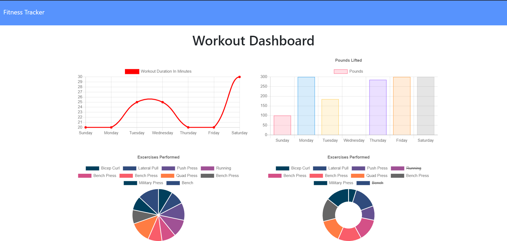

# Workout Tracker

### GitHub Username: [antnio36alv](https://github.com/antonio36alv)

[Deployed Site - Heroku](https://evening-taiga-96528.herokuapp.com/)

[GitHub Repo](https://github.com/antonio36alv/workout-tracker)

[Video Demo](https://drive.google.com/file/d/1Ewy4NydGvpeeUzfLB6jN6gH4iG4Y0zoj/view)

## Project Description

The goal of this project was to incorporate the given front end and tie in the backend. NodeJs and Express are responsbile for the backend. Mongoose is responsbile for tying up the data to the front end through certain routes.

## Installion
Requires : NodeJS, Express, Mongoose